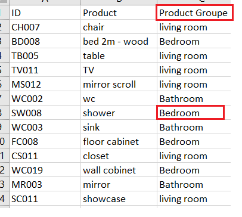

# XlsxParser

This program will parse a xlsx file for specific content and create  
a new shorted version with only the lines of interesst.

## Describtion and usage

Before using the program you have to set the <Strong><em>self.header_to_parse</Strong></em> which correspond to the content of the header.  
This column will pe filtered for <Strong><em>self.filter_column_cells_for_string</Strong></em> content  
Also be sure that the sheet of the table is correct set: <em> self.excel_sheet = self.excel_file[<Strong>'Tabelle1'<Strong>]</em>
  
<bn>
  
<Strong>Original xlsx<Strong>
  

  
<Strong>New shorted xlsx<Strong>
  

